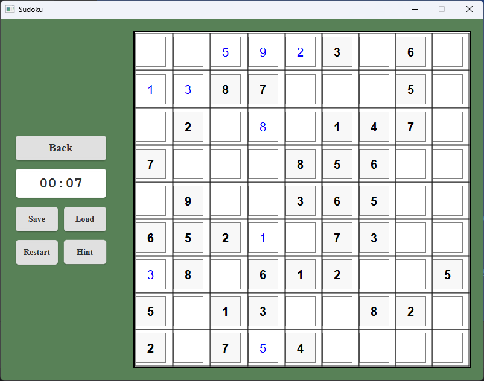

# Sudoku Game

A modern Java-based Sudoku puzzle game built with JavaFX, featuring multiple difficulty levels, save/load functionality, and multilingual support (English/Russian).



## Features

- 🎮 **Three Difficulty Levels:** Easy, Medium, Hard
- 💾 **Game Saving and Loading**
- 🌍 **Multilingual** (English & Russian)
- ⏱️ **Game Timer**
- 💡 **Hint System**
- ✨ **Modern UI** and **Real-time Validation**
- 🖥️ **Cross-platform Compatibility**

## Installation

### Windows
1. Download `Sudoku-windows.exe` from [Releases](https://github.com/13MrBlackCat13/Sudoku/releases).
2. Run the installer and follow the setup wizard.

### Linux
1. Download `Sudoku-linux.deb` from [Releases](https://github.com/13MrBlackCat13/Sudoku/releases).
2. Install with:
   ```bash
   sudo dpkg -i Sudoku-linux.deb

### macOS
1. Download `Sudoku-mac.dmg` from [Releases](https://github.com/13MrBlackCat13/Sudoku/releases).
2. Open the DMG, drag Sudoku to Applications.

### Manual (JAR Version)
1. Download `Sudoku.jar` from [Releases](https://github.com/13MrBlackCat13/Sudoku/releases).
2. Ensure Java 23+ is installed, then run:
   ```bash
   java -jar Sudoku.jar
   ```

## How to Play

1. Choose a difficulty level.
2. Select cells and enter numbers 1-9.
3. Use hints as needed; complete the puzzle by filling all cells correctly.

## Controls

- **Left Click:** Select cell
- **1-9:** Fill cell
- **Delete/Backspace:** Clear cell
- **Save/Load:** Save or load game
- **Hint:** Get help on a cell

## Building from source

### Prerequisites
- JDK 23 or later
- Maven 3.8.1 or later
- Git

### Steps
1. Clone the repository:
   ```bash
   git clone https://github.com/yourusername/Sudoku.git
   cd Sudoku
   ```

2. Build the project:
   ```bash
   mvn clean package
   ```

3. Run the application:
   ```bash
   java -jar target/Sudoku.jar
   ```

### Building native packages
The project uses jpackage to create native installers:

#### Windows
```bash
jpackage --input target/ --main-jar Sudoku.jar --main-class com.sudoku.App --type exe --name "Sudoku"
```

#### Linux
```bash
jpackage --input target/ --main-jar Sudoku.jar --main-class com.sudoku.App --type deb --name "Sudoku"
```

#### macOS
```bash
jpackage --input target/ --main-jar Sudoku.jar --main-class com.sudoku.App --type dmg --name "Sudoku"
```

## Contributing

1. Fork the repo, create a branch, make your changes, then submit a PR.

## License

Licensed under the MIT License. See [LICENSE](https://github.com/13MrBlackCat13/Sudoku/blob/master/LICENSE) for details.

---

**Contact:** [@13MrBlackCat13](https://github.com/13MrBlackCat13)
**Project Link:** [GitHub Repository](https://github.com/13MrBlackCat13/Sudoku)
```
